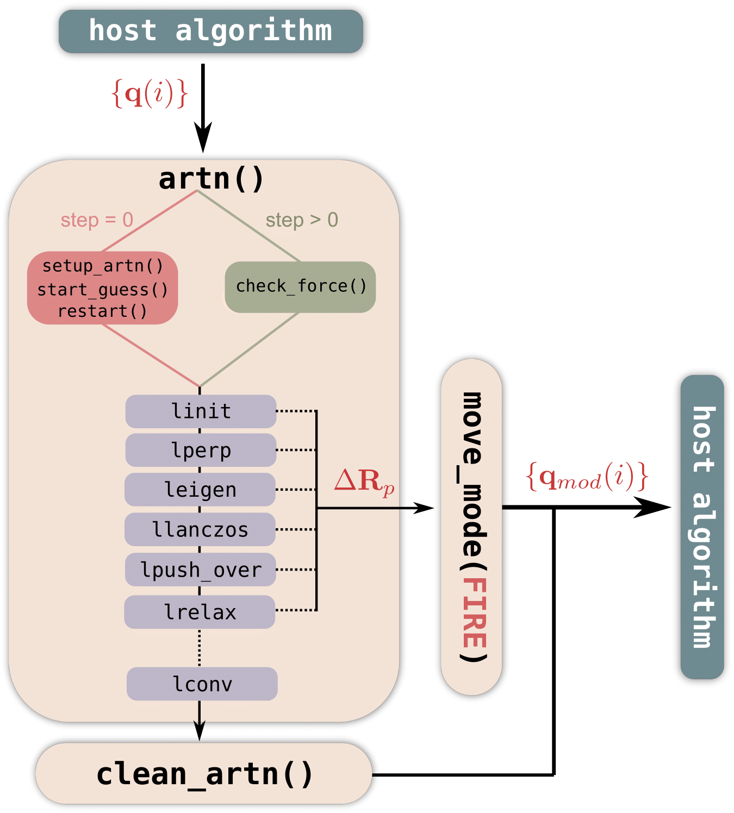

# plugin-ARTn

This is a working repository of the current version of the plugin-ARTn; currently it can be used with Quantum ESPRESSO and LAMMPS.
This code has been developped in collaboration by Matic Poberznic, Miha Gunde, Nicolas Salles and Antoine Jay.

The repository is developped on [GiLab](https://gitlab.com/mammasmias/artn-plugin) and a copy of the `master` branch is on [GitHub](https://github.com/mammasmias/ARTn-Plugin). Please put your issue on [GiLab](https://gitlab.com/mammasmias/artn-plugin).




## Contains:


- `examples/`: Contains many example including `Al-vacancy.d` and `H2+H.d` 
- `Files_LAMMPS/`: Contains the fix of lammps to interface LAMMPS/ARTn
- `Files_QE/`: Contains the file plugin_ext_forces.f90 which call the ARTn library
- `README.md`: The file you are reading
- `src/`: ARTn plugin subroutines 
- `Makefile`: Command to patch the engine and compile the library. Use the variables defined in file `environment_variables`
- `environment_variables`: User costum file in which it should be define the fortran compiler to compile the library in the variable `F90` and the path where the engine can be found in variables `LAMMPS+PATH` or `QE_PATH`


## QE-7.0/pARTn Interface 

### How to patch QE:


**Install/update the ARTn-plugin**:
First **configure** QE, then put correct paths of QE and ART in the `environment variables` file, then compile the libartn.a:

```bash
make lib
```

and then run "make patch" to patch QE

```bash
make patch-qe
```

This command recompile automatically PW.

For the QE version older than 7.0 the ARTn patch need more files.

### How to run ARTn with QE:

For example calculations please see the `examples` directory. A brief
description of the minimum requirements is provided here.

In order to run an ARTn calculation you have to add the following
lines to the QE input file `pwscf.in`:

```fortran
&CONTROL
 calculation = 'relax' 
/

&SYSTEM
  nosym = .true. 
/

&IONS
  ion_dynamics = 'fire' 
/
```

Finally Quantum ESPRESSO must be launched with the flag -partn as follow:

```bash
./pw.x -partn -inp input_pw.txt
```

 


## LAMMPS/pARTn Interface


### LAMMPS version after June 2022

#### Installation/Compilation

For the version after June 2022, LAMMPS include the a `Plugin` Class which allows to link LAMMPS with a dynamical library without to recompile at each time.

- **In LAMMPS folder**:
So first step is to compile LAMMPS in *"shared library"* mode in mpi or serial.

```bash
$ make mode=shared mpi
```
- **In the plugin-ARTn repository**:
Put the correct path in variable `LAMMPS_PATH` in file `environment_variables` as well as the fortran compiler use to compile library libartn.a in variable  `F90`.
Therefore in the variable `CXX` put the sample compiler you used to compile LAMMPS.
Then compile ARTn with the command:

```bash
$ make sharelib
```
At the end of the compilation the file `libartn.so` must appear in the folder `artn-plugin/`.


#### Use fix/artn

To be able to use the `Fix/ARTn` the plugin ARTn has to be loaded.
To load the library `libartn.so` use the command:

```bash
plugin  load  /Path-to-artn-plugin/libartn.so
```

Then you can activate the `Fix/ARTn` like all other fix in lammps:

```bash
fix ID group-ID style args value
```

with `style = artn`. For the moment we only test `group-ID = all`. It is possible to custom the FIRE parameters you want to use with the fix ARTn. For each parameter  you give the `name` following by the `value`. The parameters can be:

-  `alpha `
- `alphashrink` 
- `dtshrink`  
- `dmax `
- `tmax `
- `tmin` 

To see the meaning of these parameters refere to the min_fire web page of LAMMPS.


### LAMMPS version before June 2022

We tested this interface only with gnu compiler. 

**In the plugin-ARTn repository**: First put the correct path in variable `LAMMPS_PATH` in file `environment_variables` as well as the fortran compiler use to compile library libartn.a in variable  `F90`. Afterwards compile the library `libartn.a`:

```bash
make lib
```

patch lammps, means copy the files in `Files_LAMMPS/` to `LAMMPS_PATH/src` doing:

```bash
make patch-lammps
```

**In LAMMPS folder**: The plugin-ARTn library has to be called during the LAMMPS compilation. In the Makefile you want to use to compile it, i.e. `LAMMPS_PATH/src/MAKE/` the following lines has to be added. One variable to inform on library OPENBLAS, one to inform on the fortran library because the C++/Fortran interface and one last  to imform on the path of ART repository.
An example:

```makefile
BLAS_LIB := /usr/lib/x86_64-linux-gnu/libopenblas.a -lpthread
FORT_LIB := /usr/lib/x86_64-linux-gnu/libgfortran.so.5

ART_PATH := /home/src/artn-plugin-qe
ART_LIB := $(ART_PATH)/src/libartn.a  $(FORT_LIB) $(BLAS_LIB)
```

And the VARIABLE `ART_LIB` should be added at the moment of the executable creation, for example at the end of the line as it is shown:

```makefile
$(EXE): main.o $(LMPLIB) $(EXTRA_LINK_DEPENDS)
	$(LINK) $(LINKFLAGS) main.o $(EXTRA_PATH) $(LMPLINK) $(EXTRA_LIB) $(LIB) -o $@ $(ART_LIB)
	$(SIZE) $@
```

Now you can compile LAMMPS using the normal command with the good name of the Makefile (serial/mpi)

```bash
make yourmakefile
```


#### Use fix/artn

To activate fix ARTn is like all other fix in lammps:

```bash
fix ID group-ID style args value
```

with `style = artn`. For the moment we only test `group-ID = all`. It is possible to custom the FIRE parameters you want to use with the fix ARTn. For each parameter  you give the `name` following by the `value`. The parameters can be:

-  `alpha `
- `alphashrink` 
- `dtshrink`  
- `dmax `
- `tmax `
- `tmin` 

To see the meaning of these parameters refere to the min_fire web page of LAMMPS.


## How to use plugin-ARTn

### Philosophy

Plugin-ARTn is linked with Energy/Forces calculation Engine through the minimization algorithm FIRE. The engine should have this algorithm.  The idea is to launch the engine for a FIRE minimization and the activation of plugin-ARTn bias the minimization to apply the ARTn method.

### How to use

ARTn can be used in many different way thanks some optional variable. 

- Research from the local minimum...
- Saddle refine...

### Input and Parameters

Once the Engine is compiled with the pARTn library the ARTn input is automatically red at the first moment of the engine minimization step. The ARTn input calls `artn.in`  which allows to change all the  ARTn's parameters. It should be located in the working directory of the calculation. 

Depending of the engine the works units changes and it is to the user to be coherent between the parameters he gives and the units of the engine he uses. This warning is mainly for the **the saddle point convergence**. The user has one keywords to specify the engine he uses (`engine_units`). The list of ARTn's parameters are:

###### General features:

**The values gives by the user through the input file should be in engine units**

- `lpush_final`: Values `.true./.false.`, default is `.true.`. 
  Flag to push to adjacent minimum along eigenvector. Flag to push to the second minimum.

- `lrestart`: Values `.true./.false.`, default is `.false.`.
  Flag for restarting a ARTn calculation.  initialize the ARTn parameters and configuration from the file `artn.restart`.

- `lmove_nextmin`: Value .true./.false., default is .false. 

  Flag to leave ARTn with the new minimum found. 

- `ninit`: Value integer, by default is `3`. Number of initial pushes before lanczos start.

- `neigen`: Value integer, by default is `1`. Number of steps made with eigenvector before perpendicular relax.

- `nperp`: Value integer, by default is `3`. Maximum number of relaxation perpendicular to the move direction after an `init` or `eigen` push.

- `lnperp_limitation`: Values `.true./.false.`, default is `.true.`. 

  this option allows to constrain the number of perpendicular relaxation during the convergence to the saddle point, out of the basin. The limitation is incremental starting by 8, 12, 16, -1 (infinite). These values are stored in arrays `nperp_limitation(5)` where the first value is `nperp` in the basin. These list can be customizable in input giving the values of the array: `nperp_limitation = [...custom values]` 

- `lanc_mat_size`: Value integer, by default is `16`. Maximum number of Lanczos iterations

- `nsmooth`: Value integer, by default is `1`. Number of smoothing steps from push to eigenvector.

- `struc_format_out`: Value character, default is `"xsf"`. Output structure format. Value accepted `"xyz"` .
  Engine specific flag:

- `engine_units`: Value character, default is `qe`. For LAMMPS it is needed to specify `lammps/<units>` where `<units>` correspond to the units keywords in LAMMPS input: (`metal`, `charge`, ...)

###### The push mode:

**The values gives by the user through the input file should be in engine units**

- `push_mode`: Value character, by default is `all`. Type of initial push (`all` , `list` or `rad`)

  - `all`: The initial push is on all the atom in the box with random direction.
  - `list`: The initial push is only on atoms define in the list define by the parameter `push_ids`
  - `rad`: The initial push is on the atoms define by the parameter `push_ids` and the atoms arounds separated by the distance define by `dist_thr` parameters.

- `push_ids`: Value integer, by default is empty. Define the list of atom's id on which we define an initial push for `push_mode = list or rad`. Each atom's id are separated by a coma:

  `push_ids = 23, 201, 35`

- `dist_thr`: Value is real, by default is `0 bohr`. Distance Threshold between the atoms in `push_ids` parameters and the environment.

- `add_const`: Is an array of real, by default empty. Contains the constrain on the initial push if the user want to push in specific region of the space. The constrain contains 4 real value, 3 for the direction and 1 for the solid angle around this direction. An example for the atom 23 on which ask to go in directon (-x,0,z) with solid angle of 30 degrees: 

  `add_const(:,23)=-1.0, 0.0, 1.0, 30`

###### The saddle point convergence:

**The values gives by the user through the input file should be in engine units**

- `init_forc_thr`: Value is real, by default is `1e-2 Ry/bohr` . Initial force convergence criteria. Used for the perpendicular relax before the saddle point convergence
- `final_forc_thr`: Value is real, by default is `1e-3 Ry/bohr`. Final force convergence criteria. Used for the perpendicular relax close to the saddle point.
- `fpara_thr`: Value is real, by default is `5e-3 Ry/bohr`. Initial force convergence criteria. Used for the parallel relaxation.
- `eigval_thr`: Is a real value, by default is `-0.01 Ry/bohr^2` . Threshold for the Hessian eigen value obtain by Lanczos algorithm to start to converge to. The eigen value relative to the saddle point should be negative.
- `frelax_ene_thr`: Is a real value, by default is `-0.01 Ry`. Energy threshold at the saddle point to start relaxation to adjacent minima.
- `push_step_size`: Is a real value, by default is `0.3 bohr`. Step size of the inital push (note: the step size is limited by the engine) 
- `dlanc`: Is a real value, by default is `1e-2 bohr`. Step size in the lanczos algorithm. Should not be (`lanc_step_size`)
- `eigen_step_size`:  Is a real value, by default is `0.2 bohr`. Step size for a step with the lanczos eigenvector (note: the step size is limited by the engine).

###### Ouput:

- `verbose`: Value is integer, by default is `0`. Level `0`  print in output file at each ARTn step without flag information, at `1`  it will add the information flag and at `2`  will print at each step: define push, push and perprelax.  

## The output

Various files can be found in output. 

- The details of ARTn research is given in file named `artn.out`. This file follows the engine units defined thank to the variable `engine_units`.  It gives the system parameters evolution used by ARTn to find the saddle point as well as the the balance energies between the locals minimum and saddle point.
- At the beginnning ARTn write the initial configuration in file `initp.*` with `*` is the format choose by the user tank to the variable `struc_format_out`.
- During the ARTn convergence to the saddle point, the followed eigenvector is store in the file `lastest_engenvec.*` with `*` follows the format defined by the variable `struc_format_out`.
- For each convergence reached, saddle point and locals minimum, the configuration are stored following the format defined in variable `struc_format_out` and the name are build thank to the variables `prefix_sad` and `prefix_min`, customizable by the user, and a counter that allows to don't overwrite file if mulpile ARTn research are done in the same file.


## Issues, bugs, requests

Use the [issue](https://gitlab.com/mammasmias/artn-plugin/-/issues) traker to report the bugs.


